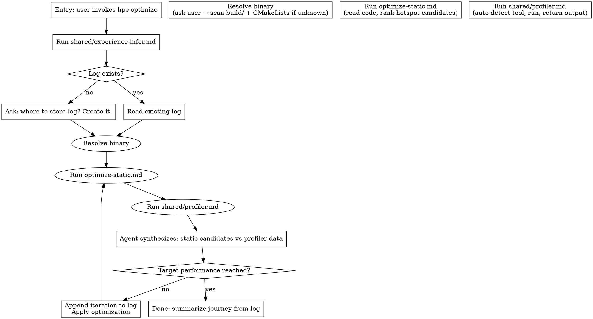

# HPC Optimize Skill — Design Spec

**Date:** 2026-04-12
**Status:** Approved, ready for implementation planning

---

## Overview

`hpc-optimize` is the optimization verb skill for the HPC skill flow system. It guides the user through iterative performance improvement of C++ HPC code by always combining static analysis (hypothesis generation) with dynamic profiling (hypothesis validation). The profiler is never skipped.

**Core principle:** Static analysis generates hotspot candidates. The profiler always runs to confirm them. Optimization decisions are made from profiler-validated evidence, not static analysis alone.

---

## Architecture

### Option chosen: Optimize sub-files + shared profiler (Approach C)

```
skills/hpc-optimize/
  SKILL.md              ← entry point: experience-infer, log setup, binary resolution, iteration loop
  optimize-static.md    ← static analysis phase: reads code, maps anti-patterns, ranks hotspot candidates

skills/shared/
  profiler.md           ← profiler auto-detect + invocation + structured output (reusable by hpc-profile)
  experience-infer.md   ← (existing, reused unchanged)
  hpc-context.md        ← (existing, reused unchanged)
```

### Responsibility boundaries

| File | Does | Does not |
|------|------|----------|
| `SKILL.md` | Log setup, binary resolution, orchestrates static→profile→optimize loop | Know how to run profilers or analyze code |
| `optimize-static.md` | Read user's code, map patterns against hpc-context, rank hotspot candidates | Run anything, write to log |
| `shared/profiler.md` | Detect tech stack, pick tool, build + run command, return structured output | Make optimization suggestions |

---

## Data Flow

### Full iteration loop



**"Target performance reached?"** is answered by the user, not auto-decided by the agent. At the end of each iteration the agent asks: "Result: X → Y. Continue optimizing or done?" and waits for explicit confirmation before looping or stopping.

### Binary resolution

1. Ask user for binary path and run arguments
2. If user doesn't know: scan `build/` for executables, read `CMakeLists.txt` for targets, present options
3. Confirm with user before running

### Log setup

- First invocation: ask user where to store the log (e.g., `hpc-optimize-log.md` at project root)
- Subsequent invocations: path remembered for the session; log read in full before each iteration
- If path already contains unrelated content: warn before writing, ask to overwrite / append / choose new path

---

## Log Format

One entry appended per iteration:

```markdown
## Run N — YYYY-MM-DD
**Binary:** `<path> <args>`
**Profiler:** <tool name>

**Static candidates:**
1. `<symbol>` — <pattern name> (<location>)
2. ...

**Profiler output (summary):**
- `<symbol>`: <% runtime>, <bottleneck signal>
- ...

**Optimization applied:** <description>
**Result:** <before> → <after> (<% improvement>)
**Hotspot shift:** <new dominant hotspot if changed>

---
```

The agent reads the full log at the start of each iteration to avoid re-addressing resolved hotspots and to understand the performance trajectory.

---

## `shared/profiler.md` — Auto-detect + Invocation

### Detection order

1. Scan for `.cu`/`.cuh` files or `find_package(CUDA|CUDAToolkit)` in CMakeLists → CUDA path
2. Check `which ncu` / `which nsys` → pick Nsight Compute (kernel-level) vs Nsight Systems (system-level)
3. If CPU-only: `which vtune` → VTune; else `which perf` → perf; else gprof fallback (recompile with `-pg`)
4. CUDA + CPU mixed → Nsight Systems first (covers both)
5. No profiler found → hard stop with install instructions

### Tool selection table

| Detected stack | Profiler | Command |
|---------------|----------|---------|
| CUDA, `ncu` available | Nsight Compute | `ncu --set full -o profile_out <binary> <args>` |
| CUDA + CPU mixed | Nsight Systems | `nsys profile -o nsys_out <binary> <args>` |
| Intel CPU + TBB/OpenMP, VTune available | Intel VTune | `vtune -collect hotspots -result-dir vtune_out -- <binary> <args>` |
| CPU-only, no VTune | perf | `perf record -g <binary> <args> && perf report` |
| CPU-only, no VTune, no perf | gprof | recompile with `-pg`, run, `gprof <binary> gmon.out` |

### Output contract

`shared/profiler.md` always returns:
- Top N hotspots by % runtime
- Key bottleneck signal per hotspot (memory bound / compute bound / latency bound)
- Raw profiler output path (for user to inspect)

`shared/profiler.md` never makes optimization suggestions — it only reports.

---

## `optimize-static.md` — Static Analysis Phase

### Process

1. Ask user which files/functions to analyze (or infer from binary target in CMakeLists)
2. Read those files
3. Scan against hpc-context anti-pattern tables for the detected stack
4. Skip patterns already resolved in prior log entries
5. Output ordered list of up to 5 candidates: location, pattern name, why it's likely hot

### Patterns checked by stack

| Stack | Patterns checked |
|-------|-----------------|
| CUDA | Uncoalesced access (AoS layout), shared memory bank conflicts, warp divergence, missing `__syncthreads__`, no stream overlap, `cudaDeviceSynchronize` in loops, non-pinned host memory, UM without prefetch |
| TBB | Grain too fine, false sharing, `concurrent_hash_map` accessor held too long, flow graph for simple fork-join, missing `tbbmalloc` |
| Taskflow | Dangling captures, new `Taskflow` per hot-loop iteration, nested executor deadlock risk |
| OpenMP | `default(shared)` data races, false sharing on per-thread arrays, unnamed `critical` bottleneck, `private` where `firstprivate` needed, `nowait` with dependent data, missing `taskwait`, nested parallelism oversubscription, non-perfectly-nested `collapse` |

### Output contract

Ordered list of up to 5 candidates. Does not run anything, does not write to log, does not make optimization recommendations.

---

## Error Handling

| Failure | Behavior |
|---------|----------|
| No profiler in PATH | Hard stop. List missing tool and install instructions. Never fall back to static-only. |
| Binary fails under profiler | Surface error output. Ask: recompile with debug symbols? wrong args? Do not guess. |
| Log path has unrelated content | Warn before writing. Ask: overwrite / append / new path. |
| CMakeLists not found / source unreadable | Surface clearly. Ask user to resolve. No silent skip. |

---

## Testing

### `hpc-optimize` smoke tests

| Test | Prompt | Expected behavior |
|------|--------|------------------|
| A | "optimize my CUDA matmul kernel" + `.cu` file | Nsight Compute selected, static scan finds coalescing candidates, log created |
| B | "speed up my TBB parallel_for loop" + source file | VTune or perf selected, static scan checks grain/false-sharing, log created |
| C | "make this faster" (no tech stack cues) | experience-infer fires, one confirmation question asked, routes correctly |
| D | No profiler in PATH | Hard stop with install instructions, no silent fallback |
| E | Existing log found | Log read, prior resolved hotspots skipped in static analysis |

### `shared/profiler.md` smoke tests

| Test | Setup | Expected |
|------|-------|----------|
| CUDA detected, `ncu` available | `.cu` in project | `ncu` command built correctly |
| CPU-only, VTune available | No `.cu`, `which vtune` passes | VTune command built |
| CPU-only, no VTune, `perf` available | No `.cu`, no vtune | `perf record` command built |
| Nothing available | No profiler in PATH | Error surfaced, no command attempted |

---

## Deployment Notes

- `docs/specs/` is excluded from plugin deployment — design docs stay in the dev repo only
- `shared/profiler.md` is the only new shared file; `experience-infer.md` and `hpc-context.md` are reused unchanged
- `hpc-profile` verb (planned) should delegate to `shared/profiler.md` directly — no duplication needed
- OpenMP static analysis patterns now fully specified (hpc-context.md OpenMP section complete)

---

## Scope

Initial implementation targets `hpc-optimize` only. `hpc-profile` as a standalone verb can reuse `shared/profiler.md` without changes.
