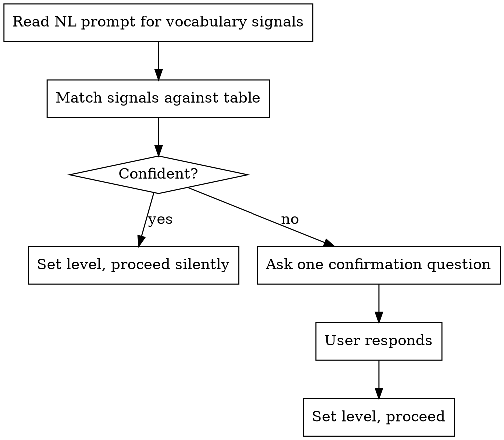
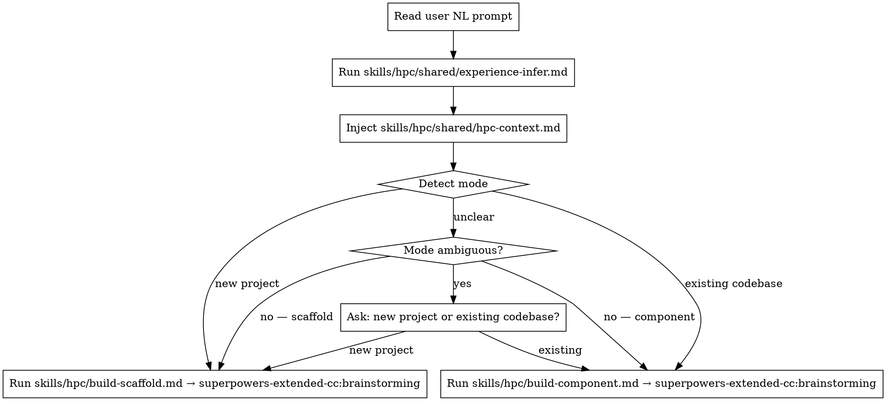
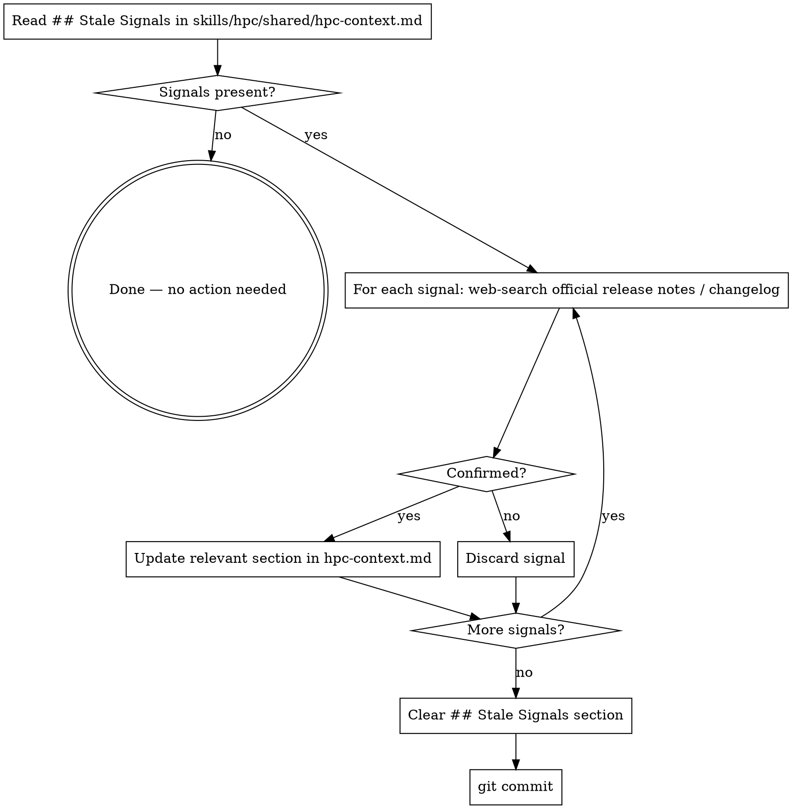

# HPC Build Skill Flow — Implementation Plan

> **For agentic workers:** REQUIRED SUB-SKILL: Use superpowers-extended-cc:subagent-driven-development (recommended) or superpowers-extended-cc:executing-plans to implement this plan task-by-task. Steps use checkbox (`- [ ]`) syntax for tracking.

**Goal:** Implement the HPC Build verb skill flow — a thin wrapper on superpowers-extended-cc:brainstorming that routes C++ HPC build requests through experience inference and mode detection, grounded by shared HPC domain context.

**Architecture:** Six files total: one router (`build.md`), two sub-skills (`build-scaffold.md`, `build-component.md`), one context refresh skill (`refresh-context.md`), one shared experience-inference skill (`experience-infer.md`), and the already-written `hpc-context.md`. All follow superpowers-extended-cc skill format exactly (YAML frontmatter, dot digraphs, minimal prose).

**Tech Stack:** Claude Code skill files (Markdown), superpowers-extended-cc:brainstorming (delegation target), superpowers-extended-cc:writing-skills (TDD for skill authoring)

---

## File Map

| Action | Path | Responsibility |
|--------|------|----------------|
| Create | `skills/hpc/shared/experience-infer.md` | Hybrid experience-level inference |
| Create | `skills/hpc/build.md` | Router: parse intent, infer experience, detect mode, delegate |
| Create | `skills/hpc/build-scaffold.md` | New-project framing for brainstorming |
| Create | `skills/hpc/build-component.md` | Existing-codebase framing for brainstorming |
| Create | `skills/hpc/refresh-context.md` | User-triggered context refresh |
| Already done | `skills/hpc/shared/hpc-context.md` | HPC domain knowledge |
| Create | `docs/superpowers/plans/2026-04-07-hpc-build-skill-flow.md.tasks.json` | Task persistence |

---

## Task 1: Write Baseline Test Scenarios (RED Phase)

**Goal:** Document expected vs. actual Claude behavior *without* the HPC skills present, for three representative prompts. This is the RED phase — the baseline that the skills will fix.

**Files:**
- Create: `docs/superpowers/tests/hpc-skill-baselines.md`

**Acceptance Criteria:**
- [ ] Three baseline scenarios documented: new project (beginner), add component (expert), ambiguous experience level
- [ ] Each scenario records: prompt used, actual Claude behavior without skills, expected behavior after skills are written
- [ ] Verb transition scenario documented: build → optimize sequence

**Steps:**

- [ ] **Step 1: Create the test scenarios document**

Create `docs/superpowers/tests/hpc-skill-baselines.md`:

```markdown
# HPC Skill Baseline Test Scenarios

## Scenario A — New Project, Beginner
**Prompt:** "I want to use the GPU to speed up my C++ code, where do I start?"
**Without skills:** Claude gives generic advice; no CMake setup, no TBB/CUDA choice, no test harness.
**Expected with skills:** Detects beginner level silently. Detects scaffold mode. Delegates to brainstorming with "new C++ HPC project" framing. Asks about library choice before proceeding.

## Scenario B — Add Component, Expert
**Prompt:** "I need to add a TBB parallel_reduce over a concurrent_vector in my existing path-generation engine."
**Without skills:** Claude may start writing code immediately without checking existing build system, existing TBB version, or thread count limits.
**Expected with skills:** Detects expert level silently. Detects component mode. Delegates to brainstorming with existing-codebase framing. Asks what inputs/outputs the component needs.

## Scenario C — Ambiguous Experience Level
**Prompt:** "Can you help me write a CUDA kernel to make this faster?"
**Without skills:** Claude proceeds without clarifying experience level.
**Expected with skills:** Detects ambiguous level (uses "CUDA kernel" — intermediate/expert term — but "make this faster" is beginner phrasing). Asks exactly one confirmation question: "Are you familiar with CUDA kernels, or would you like me to explain them as we go?"

## Scenario D — Verb Transition (build → optimize)
**Prompt 1:** "Let's scaffold a new TBB project for a graph algorithm."
**Prompt 2 (after build completes):** "Now I want to optimize the parallel_for we just wrote."
**Without skills:** Claude treats the optimize prompt as a fresh conversation; no context from build session.
**Expected with skills:** Experience level from build session carries forward; no re-inference. Optimization context acknowledges the TBB parallel_for established in build.
```

- [ ] **Step 2: Run Scenario A without skills and record actual behavior**

Open a fresh Claude Code session (no HPC skills loaded) and send:
> "I want to use the GPU to speed up my C++ code, where do I start?"

Record actual response in the baselines doc under Scenario A. Confirm it matches "no CMake setup, no library choice, no test harness" pattern.

- [ ] **Step 3: Run Scenario C without skills and record actual behavior**

In the same fresh session, send:
> "Can you help me write a CUDA kernel to make this faster?"

Record whether Claude asks an experience-level clarification question or proceeds directly. This is the baseline for experience-infer.md.

- [ ] **Step 4: Commit baselines**

```bash
git add docs/superpowers/tests/hpc-skill-baselines.md
git commit -m "test: add HPC skill baseline scenarios (RED phase)"
```

**Verify:** `docs/superpowers/tests/hpc-skill-baselines.md` exists with all four scenarios and recorded baseline behavior for A and C.

---

## Task 2: Write `shared/experience-infer.md`

**Goal:** Shared hybrid experience-inference skill that all HPC verb routers invoke. Infers level from NL vocabulary; asks exactly one question when ambiguous.

**Files:**
- Create: `skills/hpc/shared/experience-infer.md`

**Acceptance Criteria:**
- [ ] YAML frontmatter with `name` and `description` (description starts with "Use when...", no workflow summary)
- [ ] Signal → level mapping table covers expert/intermediate/beginner/ambiguous
- [ ] Dot flowchart shows full inference process
- [ ] One confirmation question template specified
- [ ] Level → output shape table (tone, terminology, scaffolding)

**Steps:**

- [ ] **Step 1: Write the skill file**

Create `skills/hpc/shared/experience-infer.md`:

```markdown
---
name: hpc-experience-infer
description: Use when an HPC verb skill needs to detect user experience level before generating guidance
---

# HPC Experience Inference

**Core principle:** Infer silently when confident. Ask exactly one question when ambiguous. Never ask for an upfront rating.

## Process



## Signal → Level Mapping

| Signals in prompt | Inferred level |
|-------------------|----------------|
| "unified memory", "task_arena affinity", "warp divergence", "concurrent_vector grow_by", "delta-stepping", "cooperative groups", "cudaFlowCapturer", "ScalablePipeline" | Expert |
| "parallel_for", "CUDA kernel", "TBB loop", "OpenMP pragma", "shared memory", "parallel reduce" | Intermediate |
| "make it faster", "use the GPU", "parallel version", "speed up my code" | Beginner |
| Mixed signals from different levels | Ambiguous → confirm |

**Confident** = all signals map to one level. **Ambiguous** = signals span two or more levels.

## The One Confirmation Question

When ambiguous, ask exactly:
> "Are you familiar with [most advanced term they used], or would you like me to explain it as we go?"

Accept any answer. Do not ask follow-up questions. Proceed.

## Level → Output Shape

| Level | Tone | Terminology | Scaffolding |
|-------|------|-------------|-------------|
| Expert | Terse, peer | Full API names and signatures | Minimal — assume pattern knowledge |
| Intermediate | Collaborative | Library names with one-line reminder | Show pattern once |
| Beginner | Guiding | Plain English first, then API name | Explain each step |

## Red Flags

- Asking more than one experience question → STOP, accept the user's first answer and proceed
- Asking for an upfront rating ("rate your experience 1–5") → NEVER do this
- Skipping inference and defaulting to intermediate → always infer from signals first
```

- [ ] **Step 2: Verify file word count is reasonable**

```bash
wc -w skills/hpc/shared/experience-infer.md
```
Expected: < 400 words. If over, trim Red Flags or compress the mapping table.

- [ ] **Step 3: Commit**

```bash
git add skills/hpc/shared/experience-infer.md
git commit -m "feat: add hpc shared experience-infer skill"
```

**Verify:** File exists at `skills/hpc/shared/experience-infer.md` with valid YAML frontmatter (`name`, `description`).

---

## Task 3: Write `skills/hpc/build.md` (Router)

**Goal:** The user-facing HPC Build router skill. Parses intent, runs experience inference, detects mode (scaffold vs component), injects HPC context, and delegates to superpowers-extended-cc:brainstorming.

**Files:**
- Create: `skills/hpc/build.md`

**Acceptance Criteria:**
- [ ] YAML frontmatter with `name: hpc-build` and triggering-condition description
- [ ] Dot flowchart covers full routing path including ambiguous mode handling
- [ ] Mode detection table with scaffold vs component signals
- [ ] Explicit references to `skills/hpc/shared/experience-infer.md`, `skills/hpc/shared/hpc-context.md`, `skills/hpc/build-scaffold.md`, `skills/hpc/build-component.md`
- [ ] Explicit delegation instruction to superpowers-extended-cc:brainstorming

**Steps:**

- [ ] **Step 1: Write the skill file**

Create `skills/hpc/build.md`:

```markdown
---
name: hpc-build
description: Use when starting C++ HPC development — scaffolding a new project or adding a parallel component to an existing codebase
---

# HPC Build

**Core principle:** Route HPC build requests to the right framing, grounded in current library APIs and adapted to experience level.

## When to Use

- "Start a new CUDA project"
- "Add a TBB parallel_for to my existing code"
- "Scaffold a new HPC application with OpenMP"
- "Implement a new cuBLAS GEMM component"

**Not for:** optimizing, debugging, porting, profiling — use the appropriate HPC verb instead.

## Process



## Mode Detection

| Signal | Mode |
|--------|------|
| "new project", "start from scratch", "scaffold", "new application", "fresh repo" | scaffold |
| "my existing code", "add to this", "this codebase", "my loop here", "extend this function" | component |
| No clear signal | Ambiguous → ask one question |

## Delegation

Before invoking superpowers-extended-cc:brainstorming, always:
1. Run `skills/hpc/shared/experience-infer.md` — sets tone and depth
2. Inject `skills/hpc/shared/hpc-context.md` — grounds guidance in current APIs
3. Load framing from `skills/hpc/build-scaffold.md` OR `skills/hpc/build-component.md`

Then invoke **superpowers-extended-cc:brainstorming** with that context.

## Red Flags

- Skipping experience inference → always run it first
- Skipping hpc-context injection → always inject before brainstorming
- Asking more than one mode-detection question → one question maximum
- Starting to write code before brainstorming completes → HARD GATE: let brainstorming finish
```

- [ ] **Step 2: Commit**

```bash
git add skills/hpc/build.md
git commit -m "feat: add hpc-build router skill"
```

**Verify:** File exists. Frontmatter parses cleanly (no YAML syntax errors).

---

## Task 4: Write `skills/hpc/build-scaffold.md`

**Goal:** Sub-skill that sets new-project framing before delegating to brainstorming. Defines success criteria for a new C++ HPC project and the clarifying questions to ask.

**Files:**
- Create: `skills/hpc/build-scaffold.md`

**Acceptance Criteria:**
- [ ] YAML frontmatter with `name: hpc-build-scaffold`
- [ ] Starting framing text to pass to brainstorming
- [ ] Ordered list of 4 clarifying questions (stop early when enough info)
- [ ] CMake snippet for each supported library (TBB, OpenMP, CUDA, SYCL)
- [ ] Concrete success criteria (cmake + ctest both green)

**Steps:**

- [ ] **Step 1: Write the skill file**

Create `skills/hpc/build-scaffold.md`:

```markdown
---
name: hpc-build-scaffold
description: Use when hpc/build.md has identified new-project mode — sets C++ HPC scaffolding framing before invoking brainstorming
---

# HPC Build — Scaffold

**Core principle:** A new C++ HPC project is not done until `cmake --build` and `ctest` both exit 0.

## Starting Framing for Brainstorming

Pass this as the initial context to superpowers-extended-cc:brainstorming:

> "We're scaffolding a new C++ HPC project. Success means: CMake builds cleanly, chosen parallel library is linked and configured, and at least one smoke test passes under `ctest`. We will not write algorithm code until the build system and test harness are green."

## Clarifying Questions (ask in order, stop when you have enough)

1. **Library:** TBB, OpenMP, SYCL, CUDA C++, or multiple?
2. **Target:** CPU-only, NVIDIA GPU, Intel GPU, or mixed?
3. **Test framework:** GoogleTest (default) or Catch2?
4. **CMake version constraint?** (default: 3.20+)

## CMake Snippets

**TBB:**
```cmake
cmake_minimum_required(VERSION 3.20)
project(hpc_app CXX)
set(CMAKE_CXX_STANDARD 20)
find_package(TBB REQUIRED)
add_executable(main src/main.cpp)
target_link_libraries(main TBB::tbb)
enable_testing()
find_package(GTest REQUIRED)
add_executable(tests tests/smoke.cpp)
target_link_libraries(tests GTest::gtest_main TBB::tbb)
add_test(NAME smoke COMMAND tests)
```

**OpenMP:**
```cmake
cmake_minimum_required(VERSION 3.20)
project(hpc_app CXX)
set(CMAKE_CXX_STANDARD 20)
find_package(OpenMP REQUIRED)
add_executable(main src/main.cpp)
target_link_libraries(main OpenMP::OpenMP_CXX)
enable_testing()
find_package(GTest REQUIRED)
add_executable(tests tests/smoke.cpp)
target_link_libraries(tests GTest::gtest_main OpenMP::OpenMP_CXX)
add_test(NAME smoke COMMAND tests)
```

**CUDA C++:**
```cmake
cmake_minimum_required(VERSION 3.20)
project(hpc_app CUDA CXX)
set(CMAKE_CXX_STANDARD 20)
set(CMAKE_CUDA_STANDARD 20)
enable_language(CUDA)
add_executable(main src/main.cu)
set_target_properties(main PROPERTIES CUDA_SEPARABLE_COMPILATION ON)
enable_testing()
find_package(GTest REQUIRED)
add_executable(tests tests/smoke.cpp)
target_link_libraries(tests GTest::gtest_main)
add_test(NAME smoke COMMAND tests)
```

**Taskflow (header-only):**
```cmake
cmake_minimum_required(VERSION 3.20)
project(hpc_app CXX)
set(CMAKE_CXX_STANDARD 20)
find_package(Taskflow REQUIRED)  # or FetchContent
add_executable(main src/main.cpp)
target_link_libraries(main Taskflow::Taskflow)
enable_testing()
find_package(GTest REQUIRED)
add_executable(tests tests/smoke.cpp)
target_link_libraries(tests GTest::gtest_main Taskflow::Taskflow)
add_test(NAME smoke COMMAND tests)
```

## Success Criteria

```bash
cmake -S . -B build -DCMAKE_BUILD_TYPE=Release  # exit 0
cmake --build build --parallel                   # exit 0
ctest --test-dir build --output-on-failure       # 1/1 tests passed
```

All three must pass before moving to algorithm implementation.
```

- [ ] **Step 2: Commit**

```bash
git add skills/hpc/build-scaffold.md
git commit -m "feat: add hpc-build-scaffold sub-skill"
```

**Verify:** File exists. CMake snippets are syntactically valid (spot-check TBB snippet).

---

## Task 5: Write `skills/hpc/build-component.md`

**Goal:** Sub-skill that sets existing-codebase framing before delegating to brainstorming. Defines the three clarifying questions and integration checklist for adding a parallel component.

**Files:**
- Create: `skills/hpc/build-component.md`

**Acceptance Criteria:**
- [ ] YAML frontmatter with `name: hpc-build-component`
- [ ] Starting framing text for brainstorming (existing-codebase mode)
- [ ] Exactly three clarifying questions in order
- [ ] Integration checklist (5 items)
- [ ] Success criteria (existing tests + new tests both pass)

**Steps:**

- [ ] **Step 1: Write the skill file**

Create `skills/hpc/build-component.md`:

```markdown
---
name: hpc-build-component
description: Use when hpc/build.md has identified existing-codebase mode — sets component-addition framing before invoking brainstorming
---

# HPC Build — Component

**Core principle:** A new parallel component must not break existing tests and must be verifiable in isolation before integration.

## Starting Framing for Brainstorming

Pass this as the initial context to superpowers-extended-cc:brainstorming:

> "We're adding a new parallel component to an existing C++ codebase. The component must: compile in isolation, have its own tests, and integrate without breaking the existing test suite. We do not start writing the component until we know its inputs, outputs, and which parallel library the codebase already uses."

## Clarifying Questions (ask in order, stop when you have enough)

1. **Existing parallel library?** (TBB/OpenMP/CUDA/Taskflow — match the codebase to avoid mixing schedulers)
2. **What should the component do?** (algorithm, pipeline stage, data structure transformation, etc.)
3. **Inputs and outputs?** (types, sizes, ownership — e.g., `const std::vector<float>&` in, `tbb::concurrent_vector<float>` out)

## Integration Checklist

Before declaring the component done:

- [ ] Component compiles in its own translation unit without touching other files
- [ ] No shared mutable state with existing code (or existing mutex/arena covers it)
- [ ] Existing test suite still passes: `ctest --test-dir build --output-on-failure`
- [ ] New component has at least one unit test that passes in isolation
- [ ] Thread count does not exceed any existing `task_arena` limit or `OMP_NUM_THREADS` setting

## Success Criteria

```bash
cmake --build build --parallel                  # exit 0
ctest --test-dir build --output-on-failure      # all existing tests pass
./build/tests/component_tests                   # new component tests pass
```
```

- [ ] **Step 2: Commit**

```bash
git add skills/hpc/build-component.md
git commit -m "feat: add hpc-build-component sub-skill"
```

**Verify:** File exists. Integration checklist has exactly 5 items. Success criteria commands are syntactically correct.

---

## Task 6: Write `skills/hpc/refresh-context.md`

**Goal:** User-triggered skill to review Stale Signals in `hpc-context.md`, confirm each signal via web search, apply updates to the relevant section, and commit.

**Files:**
- Create: `skills/hpc/refresh-context.md`

**Acceptance Criteria:**
- [ ] YAML frontmatter with `name: hpc-refresh-context`
- [ ] Dot flowchart showing read → confirm → apply/discard → clear → commit
- [ ] Explicit definition of "confirm" (web-search for official release notes)
- [ ] File path to modify (`skills/hpc/shared/hpc-context.md`)
- [ ] Exact commit message template

**Steps:**

- [ ] **Step 1: Write the skill file**

Create `skills/hpc/refresh-context.md`:

```markdown
---
name: hpc-refresh-context
description: Use when Stale Signals exist in hpc-context.md and need to be reviewed, confirmed, and applied as updates to the domain knowledge
---

# HPC Refresh Context

**Core principle:** Confirmed signals get applied; unconfirmed signals get discarded. Main content sections are only modified after web-search confirmation.

## Process



## What "Confirm" Means

For each signal (e.g., "oneTBB 2022.1 removes `parallel_pipeline`"):
- Web-search: official Intel oneTBB changelog, NVIDIA CUDA release notes, or Taskflow GitHub releases
- If the source is official and the change is real → confirmed
- If the source is a blog post, StackOverflow, or unverifiable → discard

## File to Modify

`skills/hpc/shared/hpc-context.md`

Apply confirmed updates to the relevant section:
- Deprecations → add row to Deprecations table
- New API → add to appropriate Quick Reference or API section
- Changed behavior → update the relevant paragraph inline

After all signals processed, clear the entire `## Stale Signals` section body (keep the heading, set body to: `*No signals. Scheduled agent will append findings here weekly.*`).

## Commit

```bash
git add skills/hpc/shared/hpc-context.md
git commit -m "chore: refresh hpc-context — applied N confirmed signals, discarded M"
```

## Red Flags

- Applying an unconfirmed signal → always web-search first
- Modifying main content sections without a corresponding signal → do not make unprompted edits
- Leaving the Stale Signals section populated after refresh → always clear it at the end
```

- [ ] **Step 2: Commit**

```bash
git add skills/hpc/refresh-context.md
git commit -m "feat: add hpc-refresh-context skill"
```

**Verify:** File exists. Dot flowchart has a clear terminal state (`git commit`). Red Flags section has 3 items.

---

## Task 7: Verify All Skills — GREEN Phase

**Goal:** Run the baseline test scenarios from Task 1 *with* all skills now present. Confirm each scenario produces the expected behavior. Document results.

**Files:**
- Modify: `docs/superpowers/tests/hpc-skill-baselines.md` (add GREEN phase results)

**Acceptance Criteria:**
- [ ] Scenario A (beginner, new project): Claude detects beginner level silently, detects scaffold mode, delegates to brainstorming with scaffold framing
- [ ] Scenario B (expert, add component): Claude detects expert level silently, detects component mode, delegates to brainstorming with component framing
- [ ] Scenario C (ambiguous experience): Claude asks exactly one confirmation question matching the template in experience-infer.md
- [ ] Scenario D (build → optimize transition): Experience level not re-inferred from scratch; context from build session acknowledged

**Steps:**

- [ ] **Step 1: Run Scenario A with skills**

Open a Claude Code session with the `skills/hpc/` directory loaded. Send:
> "I want to use the GPU to speed up my C++ code, where do I start?"

Expected behavior:
- No experience-level question (beginner detected from "use the GPU", "where do I start")
- One mode question NOT asked (ambiguous prompt) OR Claude asks "Are you starting a new project or adding to existing code?"
- Brainstorming invoked with scaffold framing: mentions CMake setup, library choice, test harness

Record result in `hpc-skill-baselines.md` under `## GREEN Phase Results → Scenario A`.

- [ ] **Step 2: Run Scenario C with skills (experience inference)**

Send:
> "Can you help me write a CUDA kernel to make this faster?"

Expected: Claude asks exactly:
> "Are you familiar with CUDA kernels, or would you like me to explain them as we go?"

And no further experience questions after the user responds.

Record result under `## GREEN Phase Results → Scenario C`.

- [ ] **Step 3: Run Scenario B with skills (expert, component)**

Send:
> "I need to add a TBB parallel_reduce over a concurrent_vector in my existing path-generation engine."

Expected:
- No experience question (expert signals: `parallel_reduce`, `concurrent_vector`)
- Component mode detected from "existing path-generation engine"
- Brainstorming invoked with component framing: asks what library the codebase uses, component inputs/outputs

Record result under `## GREEN Phase Results → Scenario B`.

- [ ] **Step 4: Note any loopholes found**

If Claude skips a step, asks too many questions, or makes a wrong routing decision, record it as a loophole in `hpc-skill-baselines.md` and open a follow-up fix in the relevant skill file before committing.

- [ ] **Step 5: Commit GREEN phase results**

```bash
git add docs/superpowers/tests/hpc-skill-baselines.md
git commit -m "test: record GREEN phase results for HPC build skill flow"
```

**Verify:** `hpc-skill-baselines.md` has GREEN phase results for Scenarios A, B, C. No loopholes left unresolved.

---

## Task 8: Set Up Scheduled Staleness Agent

**Goal:** Configure a weekly scheduled agent (via `schedule` skill) that web-searches for HPC stack deprecations/updates and appends findings to `## Stale Signals` in `hpc-context.md`.

**Files:**
- No new files — configured via `schedule` skill

**Acceptance Criteria:**
- [ ] Scheduled agent created via `schedule` skill with weekly cadence
- [ ] Agent prompt instructs: search for TBB/CUDA/Taskflow/OpenMP/SYCL release notes and deprecation notices; append findings to `## Stale Signals` in `skills/hpc/shared/hpc-context.md`; do NOT modify main content sections
- [ ] Agent verified: dry-run or first invocation produces a Stale Signals entry without modifying other sections

**Steps:**

- [ ] **Step 1: Invoke the schedule skill**

Use the `schedule` skill to create a weekly agent. Agent prompt:

```
You are a weekly HPC stack staleness detector for the hpc-superpowers project at /home/cchang289/Research/hpc-superpowers.

Your job:
1. Web-search for recent (last 7 days) release notes, deprecation notices, or API changes for:
   - Intel oneTBB (oneapi-src/oneTBB GitHub releases, Intel developer blog)
   - NVIDIA CUDA (developer.nvidia.com/cuda-toolkit-archive, CUDA release notes)
   - Taskflow (taskflow/taskflow GitHub releases)
   - OpenMP (openmp.org news)
   - SYCL/DPC++ (intel.com/oneapi/dpc++ changelog)
   - cuBLAS, cuDNN, cuSPARSE (NVIDIA library release notes)

2. For each finding that is a deprecation, removal, new API, or significant behavior change:
   - Write one bullet point: `- [DATE] [LIBRARY vX.Y]: [what changed and why it matters for HPC C++ code]`

3. Open the file `skills/hpc/shared/hpc-context.md`.
   - Find the `## Stale Signals` section at the bottom.
   - Append your bullet points there.
   - Do NOT modify any other section of the file.

4. If no relevant changes found, append: `- [DATE] No significant changes found this week.`

5. Commit: git add skills/hpc/shared/hpc-context.md && git commit -m "chore: weekly hpc-context staleness scan [DATE]"
```

- [ ] **Step 2: Verify agent configuration**

Run `schedule list` and confirm the new agent appears with weekly cadence.

- [ ] **Step 3: Dry-run the agent once**

Trigger a manual run to confirm the agent appends to `## Stale Signals` without modifying other sections.

```bash
# Check that only the Stale Signals section was modified
git diff HEAD~1 skills/hpc/shared/hpc-context.md
```

Expected: only lines within `## Stale Signals` appear in the diff.

**Verify:** Scheduled agent exists and dry-run produces correct output.

---

## Task 9: Final Commit and Push

**Goal:** Ensure all files are committed, the repo is clean, and changes are pushed to the remote fork.

**Files:**
- All files in `skills/hpc/` and `docs/`

**Acceptance Criteria:**
- [ ] `git status` shows clean working tree
- [ ] All 5 new skill files committed
- [ ] Test baselines committed
- [ ] Pushed to `origin/main`

**Steps:**

- [ ] **Step 1: Verify clean state**

```bash
git status
```
Expected: `nothing to commit, working tree clean`

If any files are untracked or modified, stage and commit them now.

- [ ] **Step 2: Push to remote**

```bash
git push origin main
```

- [ ] **Step 3: Verify remote**

```bash
git log --oneline origin/main | head -10
```

Confirm all task commits appear.

**Verify:** `git log --oneline | head -10` shows commits for Tasks 1–8 in order.
