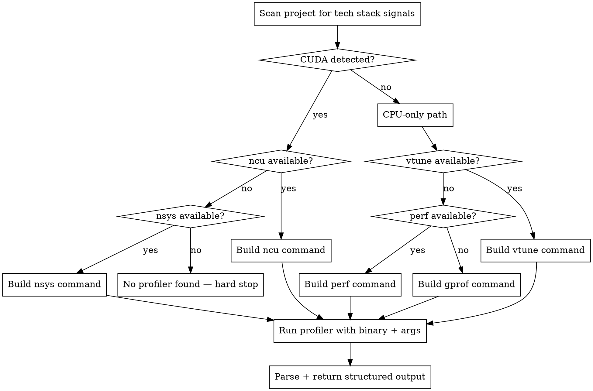
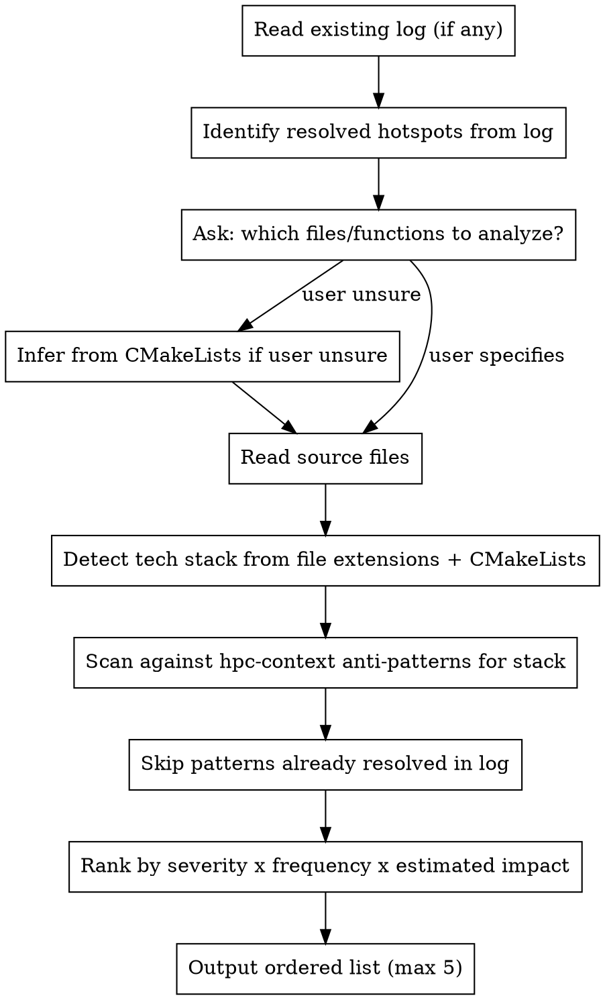
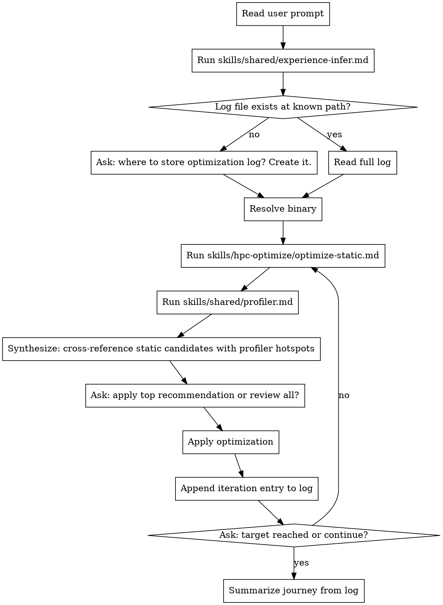

# HPC Optimize Skill — Implementation Plan

> **For agentic workers:** REQUIRED SUB-SKILL: Use superpowers-extended-cc:subagent-driven-development (recommended) or superpowers-extended-cc:executing-plans to implement this plan task-by-task. Steps use checkbox (`- [ ]`) syntax for tracking.

**Goal:** Implement the `hpc-optimize` verb skill — iterative C++ HPC performance optimization combining static analysis (hypothesis generation) with always-on profiling (hypothesis validation), tracked in a per-session log.

**Architecture:** Three new skill files + one command. `shared/profiler.md` handles profiler auto-detection and invocation (reusable by future `hpc-profile`). `hpc-optimize/optimize-static.md` scans code against hpc-context anti-patterns. `hpc-optimize/SKILL.md` orchestrates the full iteration loop with log management. All follow superpowers-extended-cc SKILL.md convention: YAML frontmatter, dot digraphs, minimal prose.

**Tech Stack:** Claude Code skill files (Markdown), `shared/experience-infer.md` (existing, reused), `shared/hpc-context.md` (existing, reused), Nsight Compute, Nsight Systems, Intel VTune, perf, gprof

---

## File Map

| Action | Path | Responsibility |
|--------|------|----------------|
| Create | `skills/shared/profiler.md` | Profiler auto-detect, command build, invocation, structured output |
| Create | `skills/hpc-optimize/optimize-static.md` | Read code, scan anti-patterns, output ranked candidates |
| Create | `skills/hpc-optimize/SKILL.md` | Entry point: experience-infer, log setup, binary resolution, iteration loop |
| Create | `commands/hpc-optimize.md` | Slash command invoking hpc-optimize skill |
| Modify | `docs/superpowers/tests/hpc-skill-baselines.md` | Add optimize scenarios A–E (RED phase) and GREEN phase results |

---

## Task 1: Write Optimize Baseline Test Scenarios (RED Phase)

**Files:**
- Modify: `docs/superpowers/tests/hpc-skill-baselines.md`

- [ ] **Step 1: Append optimize scenarios to baselines doc**

Open `docs/superpowers/tests/hpc-skill-baselines.md` and append after the existing GREEN Phase Results section:

```markdown
---

# HPC Optimize Baseline Test Scenarios

> RED phase baselines recorded before hpc-optimize skill was written.
> GREEN phase results to be added after skills are implemented (Task 5).

---

## Scenario A — CUDA kernel, intermediate user

**Prompt:** "Optimize my CUDA matrix multiply kernel" (user provides a `.cu` file with AoS layout)

**Without skills (baseline):** Claude may suggest optimizations based on reading the code, but will not run a profiler, will not distinguish confirmed from speculative hotspots, and will not maintain any log of what was tried.

**Expected with skills:**
- experience-infer: detects intermediate (CUDA vocabulary present, no expert-level terms)
- Log check: no log found → asks where to store it
- Binary resolution: asks user for binary path + args
- optimize-static: finds AoS layout → uncoalesced access candidate
- profiler: detects CUDA → `ncu` or `nsys`; runs profiler; returns global load efficiency stat
- Synthesis: AoS candidate confirmed by profiler → recommended as top priority
- Applies SoA fix; appends Run 1 to log
- Asks: "Result: Xms → Yms. Continue optimizing or done?"

---

## Scenario B — TBB parallel_for, expert user

**Prompt:** "Speed up my TBB parallel_for — grain size is 1 and it's slower than serial"

**Without skills (baseline):** Claude likely suggests increasing grain size immediately without profiling to confirm the cause, and without checking whether `tbbmalloc` is linked.

**Expected with skills:**
- experience-infer: detects expert (TBB vocabulary, grain size terminology)
- No confirmation question asked
- optimize-static: finds grain=1 → "grain too fine" candidate; checks for `new` inside loop body → missing `tbbmalloc` candidate
- profiler: detects CPU-only → VTune or perf; confirms which hotspot dominates
- Synthesis: grain candidate or tbbmalloc candidate prioritized by profiler data
- Applies fix; appends Run 1 to log

---

## Scenario C — No profiler in PATH

**Prompt:** "Optimize my OpenMP loop" (no `ncu`, `nsys`, `vtune`, or `perf` in PATH)

**Without skills (baseline):** Claude proceeds with static analysis or guesses.

**Expected with skills:**
- optimize-static runs and finds candidates
- profiler.md: no profiler detected → hard stop with install instructions
- Skill does NOT proceed to optimization
- Output: "No profiler found. Install one of: [instructions]"

---

## Scenario D — Existing log found, second iteration

**Prompt:** User re-invokes `/hpc-optimize` after Run 1 already logged AoS fix

**Without skills (baseline):** Claude has no memory of prior run; may suggest re-fixing AoS.

**Expected with skills:**
- Log found at known path → read in full
- optimize-static: skips AoS pattern (already resolved per log)
- profiler: re-runs; hotspot has shifted to reduction kernel
- Synthesis: new top hotspot identified
- Appends Run 2 to log

---

## Scenario E — User doesn't know binary path

**Prompt:** "Optimize my app" (no binary path specified)

**Without skills (baseline):** Claude may ask or may try to find it, inconsistently.

**Expected with skills:**
- Binary resolution: asks user first
- User responds "I don't know"
- Skill scans `build/` for executables, reads `CMakeLists.txt` for `add_executable` targets
- Presents numbered list; asks user to pick
- Confirms full invocation before running profiler

---

## GREEN Phase Results

*To be filled after Task 5 baselines run.*
```

- [ ] **Step 2: Commit**

```bash
git add docs/superpowers/tests/hpc-skill-baselines.md
git commit -m "test: add hpc-optimize RED phase baselines (A–E)"
```

---

## Task 2: Create `shared/profiler.md`

**Files:**
- Create: `skills/shared/profiler.md`

- [ ] **Step 1: Create the file**

Create `skills/shared/profiler.md` with this exact content:

```markdown
---
name: hpc-profiler
description: Use when an HPC verb skill needs to detect and run a profiler — auto-selects Nsight Compute, Nsight Systems, VTune, perf, or gprof based on detected tech stack
---

# HPC Profiler — Auto-detect + Invocation

**Core principle:** Detect the right profiler for the tech stack, build the correct invocation, run it, and return structured output. Never make optimization suggestions — only report.

## Process



## Stack Detection

Scan the project root for these signals in order:

1. `.cu` or `.cuh` files present, OR `find_package(CUDA` or `find_package(CUDAToolkit` in any `CMakeLists.txt` → **CUDA detected**
2. CUDA detected: `which ncu` → Nsight Compute; else `which nsys` → Nsight Systems; else hard stop
3. CPU-only: `which vtune` → VTune; else `which perf` → perf; else gprof

**Mixed CUDA + CPU:** prefer Nsight Systems (`nsys`) — covers both CPU and GPU timelines.

## Tool Selection + Commands

| Stack | Profiler | Command |
|-------|----------|---------|
| CUDA, `ncu` available | Nsight Compute | `ncu --set full -o ncu_profile <binary> <args>` |
| CUDA + CPU mixed, or no `ncu` | Nsight Systems | `nsys profile -o nsys_profile <binary> <args>` |
| CPU + TBB/OpenMP, VTune available | Intel VTune | `vtune -collect hotspots -result-dir vtune_out -- <binary> <args>` |
| CPU-only, no VTune | perf | `perf record -g -o perf.data <binary> <args> && perf report --stdio -i perf.data` |
| CPU-only, no perf | gprof | Recompile with `-pg -g`, run `<binary> <args>`, then `gprof <binary> gmon.out > gprof_report.txt` |

**gprof recompile note:** If gprof is the only option and the binary was not compiled with `-pg`, instruct the user to add `-pg -g` to `CMAKE_CXX_FLAGS` in CMakeLists.txt and rebuild before continuing.

**Release build check:** Before running, verify the binary was built with `-O2` or higher. Warn if profiling a debug build: "Profiling a debug build gives misleading results — rebuild with Release or RelWithDebInfo first."

## No Profiler Found

If no profiler is detected, output exactly:

```
No profiler found for your stack.
Detected: [CUDA | CPU-only]
Install one of:
  CUDA:    sudo apt install nsight-compute nsight-systems
           OR add /usr/local/cuda/bin to PATH
  CPU/x86: sudo apt install intel-oneapi-vtune
           OR sudo apt install linux-tools-$(uname -r)
```

Hard stop. Do not proceed. Do not fall back to static-only analysis.

## Output Contract

After running, return exactly:

```
Profiler: <tool name>
Binary: <path> <args>
Output file: <path>

Top hotspots:
1. <symbol> — <% runtime> — <bottleneck: memory-bound | compute-bound | latency-bound>
2. ...
(up to 5 hotspots)
```

Do not interpret results. Do not suggest optimizations. Reporting only.

## Red Flags

- Proceeding to optimize without profiler output → profiler is never optional
- Guessing the binary path without user confirmation → always confirm before running
- Reporting results from a debug build → warn and offer to rebuild as Release first
```

- [ ] **Step 2: Verify the file was created correctly**

```bash
head -5 skills/shared/profiler.md
```

Expected output:
```
---
name: hpc-profiler
description: Use when an HPC verb skill needs to detect and run a profiler ...
---
```

- [ ] **Step 3: Commit**

```bash
git add skills/shared/profiler.md
git commit -m "feat: add shared/profiler.md — profiler auto-detect and invocation"
```

---

## Task 3: Create `hpc-optimize/optimize-static.md`

**Files:**
- Create: `skills/hpc-optimize/optimize-static.md`

- [ ] **Step 1: Create the file**

Create `skills/hpc-optimize/optimize-static.md` with this exact content:

```markdown
---
name: hpc-optimize-static
description: Use when hpc-optimize needs to generate hotspot candidates from code before profiling — reads source, scans against hpc-context anti-patterns, outputs ranked candidates
---

# HPC Optimize — Static Analysis

**Core principle:** Read the code. Map it against known anti-patterns in hpc-context.md. Rank candidates. Output hypotheses for the profiler to validate. Do not run anything.

## Process



## Anti-Pattern Scan by Stack

### CUDA (scan `.cu`, `.cuh` files)

| Anti-pattern | Signal in code |
|-------------|----------------|
| Uncoalesced global memory (AoS layout) | Struct array indexed by `threadIdx` where struct fields accessed across threads |
| Shared memory bank conflicts | `__shared__` array indexed with stride divisible by 32 |
| Warp divergence | `if (threadIdx.x % N)` where N is not `warpSize` |
| Missing `__syncthreads()` | Write to `__shared__` followed by read with no sync between |
| `cudaDeviceSynchronize` in loop | `cudaDeviceSynchronize()` call inside a `for` or `while` body |
| Non-pinned host memory with async copy | `cudaMemcpyAsync` with host pointer not allocated via `cudaMallocHost` |
| UM without prefetch | `cudaMallocManaged` with no `cudaMemPrefetchAsync` before first kernel |

### TBB (scan `.cpp`, `.h` files with `#include <tbb/...>`)

| Anti-pattern | Signal in code |
|-------------|----------------|
| Grain too fine | `parallel_for` with `blocked_range` grain argument of 1 |
| False sharing | `std::vector<int>` or `std::vector<double>` indexed by thread ID via `tbb::this_task_arena::current_thread_index()` |
| `concurrent_hash_map` accessor held too long | `accessor` constructed and used across multiple map operations in same scope |
| Flow graph for simple fork-join | `tbb::flow::graph` with only 2–3 nodes and no complex dependency chain |
| Missing `tbbmalloc` | `std::make_unique`, `std::make_shared`, or bare `new` inside `parallel_for` body |

### OpenMP (scan files with `#pragma omp`)

| Anti-pattern | Signal in code |
|-------------|----------------|
| `default(shared)` data race risk | `#pragma omp parallel` without `default(none)` + mutable variable in body |
| False sharing | `int result[N]` or similar per-thread array indexed by `omp_get_thread_num()` |
| Unnamed `critical` bottleneck | Two or more `#pragma omp critical` without name qualifiers |
| `private` where `firstprivate` needed | Variable initialized before `parallel for` but declared `private` |
| `nowait` with dependent data | `nowait` on a loop whose output is consumed immediately after |
| Missing `taskwait` | `#pragma omp task` with result read before a `#pragma omp taskwait` |
| Nested parallelism oversubscription | `#pragma omp parallel` inside another `parallel` region without `omp_set_max_active_levels(1)` |
| Non-perfect `collapse` | `collapse(2)` on loops with any code between the two loop headers |

### Taskflow (scan files with `#include <taskflow/...>`)

| Anti-pattern | Signal in code |
|-------------|----------------|
| Dangling lambda captures | `[&]` in task lambda capturing a local variable that may go out of scope before task runs |
| New `Taskflow` per hot-loop iteration | `tf::Taskflow` constructed inside a `for` or `while` loop body |
| Nested executor deadlock | `executor.run(tf).wait()` called from within a running task body |

## Output Contract

```
Static candidates (before profiling):
1. [HIGH] <symbol/file:line> — <pattern name>
   Why likely hot: <one sentence>
2. [MED] ...
3. ...
(max 5; patterns already resolved in log are omitted)
```

Severity: HIGH = known to dominate runtime in this pattern; MED = likely contributor; LOW = possible but speculative.

Does not run anything. Does not write to log. Does not make optimization recommendations.

## Red Flags

- Recommending an optimization in this phase → output candidates only, not fixes
- Including more than 5 candidates → rank and cut; quality over quantity
- Re-listing a pattern already marked resolved in the log → always check log first
```

- [ ] **Step 2: Verify**

```bash
head -5 skills/hpc-optimize/optimize-static.md
```

Expected:
```
---
name: hpc-optimize-static
description: Use when hpc-optimize needs to generate hotspot candidates ...
---
```

- [ ] **Step 3: Commit**

```bash
git add skills/hpc-optimize/optimize-static.md
git commit -m "feat: add hpc-optimize/optimize-static.md — static analysis phase"
```

---

## Task 4: Create `hpc-optimize/SKILL.md` and `commands/hpc-optimize.md`

**Files:**
- Create: `skills/hpc-optimize/SKILL.md`
- Create: `commands/hpc-optimize.md`

- [ ] **Step 1: Create `skills/hpc-optimize/SKILL.md`**

```markdown
---
name: hpc-optimize
description: Use when optimizing C++ HPC code — static analysis then always-on profiling to validate hotspots, with a per-session log tracking the optimization journey
---

# HPC Optimize

**Core principle:** Static analysis generates hotspot candidates. The profiler always runs to confirm them. Optimization decisions are made from profiler-validated evidence. Progress is logged every iteration.

## When to Use

- "Optimize my CUDA kernel"
- "Speed up this TBB parallel_for"
- "My OpenMP loop is slower than expected"
- "Profile and fix this HPC bottleneck"

**Not for:** building from scratch (`hpc-build`), porting between libraries (`hpc-port`), or debugging correctness (`hpc-debug`).

## Process



## Binary Resolution

1. Ask: "What is the path to your binary and the arguments to run it?"
2. If user doesn't know:
   - Run: `find build/ -type f -executable 2>/dev/null` to list candidates
   - Scan `CMakeLists.txt` for `add_executable` target names
   - Present numbered list: "Found: (1) build/bin/matmul  (2) build/tests/unit_tests — which one?"
3. Always confirm full invocation before running: "I'll run: `./build/bin/matmul --size 4096` — correct?"

## Log Format

One entry appended per completed iteration:

```markdown
## Run N — YYYY-MM-DD
**Binary:** `<path> <args>`
**Profiler:** <tool>

**Static candidates:**
1. `<symbol>` — <pattern> (<file:line>)

**Profiler output (summary):**
- `<symbol>`: <% runtime>, <bottleneck signal>

**Optimization applied:** <description>
**Result:** <before> → <after> (<% change>)
**Hotspot shift:** <new dominant hotspot, or "none">

---
```

## Synthesis Step

After static analysis and profiling both complete, cross-reference results:

```
Confirmed hotspots (both static + profiler):
  1. <symbol> — <pattern> — <% runtime>   ← highest priority

Profiler-only (static missed):
  2. <symbol> — <% runtime> — (pattern not in hpc-context)

Static-only (not confirmed by profiler — skip for now):
  - <symbol> — <pattern> — not in top profiler hotspots
```

Pattern not in hpc-context → note: "Consider running `/hpc-refresh-context` to update domain knowledge."

## Error Handling

| Failure | Action |
|---------|--------|
| No profiler in PATH | Hard stop. Output install instructions from `skills/shared/profiler.md`. Do not proceed. |
| Binary crashes under profiler | Surface stderr. Ask: "Rebuild with `-g -O2`? Check args?" Do not guess. |
| Log path has unrelated content | Warn before writing. Ask: "Overwrite / append / choose new path?" |
| No source files found | Ask user to specify files or point to `CMakeLists.txt` |

## Red Flags

- Applying an optimization not confirmed by profiler → always cross-reference both sources
- Skipping the profiler because static analysis looks conclusive → profiler is never optional
- Re-asking experience level on the second iteration → infer once per session, carry forward
- Reporting % improvement without re-running profiler → always re-profile before claiming gain
- Marking a hotspot resolved without running the profiler to confirm the gain → re-profile required
```

- [ ] **Step 2: Verify**

```bash
head -5 skills/hpc-optimize/SKILL.md
```

Expected:
```
---
name: hpc-optimize
description: Use when optimizing C++ HPC code ...
---
```

- [ ] **Step 3: Create `commands/hpc-optimize.md`**

```markdown
---
description: "Optimize C++ HPC code — static analysis + always-on profiling to validate hotspots (CUDA/TBB/OpenMP/Taskflow), with a per-session optimization log"
---

Invoke the hpc-superpowers:hpc-optimize skill and follow it exactly as presented to you
```

- [ ] **Step 4: Verify**

```bash
head -3 commands/hpc-optimize.md
```

Expected:
```
---
description: "Optimize C++ HPC code — static analysis + always-on profiling ...
---
```

- [ ] **Step 5: Commit**

```bash
git add skills/hpc-optimize/SKILL.md commands/hpc-optimize.md
git commit -m "feat: add hpc-optimize/SKILL.md and /hpc-optimize slash command"
```

---

## Task 5: Run Baselines and Record GREEN Phase Results

**Files:**
- Modify: `docs/superpowers/tests/hpc-skill-baselines.md`

For each scenario, trace the skill logic manually against the written skill files (same method used for hpc-build baselines). The plugin does not need to be live-registered — logic tracing is equivalent for flow validation.

- [ ] **Step 1: Trace Scenario A (CUDA kernel, intermediate)**

Trace prompt "Optimize my CUDA matrix multiply kernel" through:
1. `skills/shared/experience-infer.md`: "CUDA" + "matrix multiply" → intermediate, no question ✓ or ✗?
2. `SKILL.md`: no log found → asks for log path ✓ or ✗?
3. `SKILL.md`: asks for binary path ✓ or ✗?
4. `optimize-static.md`: detects CUDA, scans for AoS / uncoalesced patterns ✓ or ✗?
5. `profiler.md`: detects CUDA → builds `ncu` command ✓ or ✗?
6. `SKILL.md` synthesis: cross-references static + profiler, presents confirmed hotspots ✓ or ✗?
7. `SKILL.md`: after optimization, appends to log ✓ or ✗?
8. `SKILL.md`: asks "target reached or continue?" ✓ or ✗?

Record result and verdict in baselines doc under GREEN Phase.

- [ ] **Step 2: Trace Scenario B (TBB parallel_for, expert)**

Trace "Speed up my TBB parallel_for — grain size is 1":
1. experience-infer: "TBB", "parallel_for", "grain size" → expert, no question ✓ or ✗?
2. optimize-static: finds `blocked_range` with grain=1 → "grain too fine" candidate ✓ or ✗?
3. optimize-static: checks for `new` inside loop body → "missing tbbmalloc" candidate if present ✓ or ✗?
4. profiler: CPU-only → VTune or perf command built ✓ or ✗?

Record result.

- [ ] **Step 3: Trace Scenario C (no profiler)**

Trace "Optimize my OpenMP loop" with no profiler in PATH:
1. optimize-static: runs and outputs candidates ✓ or ✗?
2. profiler: no tool found → hard stop with install instructions ✓ or ✗?
3. SKILL.md: does NOT proceed past profiler error ✓ or ✗?

Record result.

- [ ] **Step 4: Trace Scenario D (second iteration, log exists)**

Simulate log with Run 1 having resolved AoS pattern:
1. SKILL.md: log found → read in full ✓ or ✗?
2. optimize-static: AoS pattern skipped (already in log) ✓ or ✗?
3. profiler: re-runs, returns new top hotspot ✓ or ✗?
4. SKILL.md: appends Run 2 ✓ or ✗?

Record result.

- [ ] **Step 5: Trace Scenario E (user doesn't know binary path)**

Trace "Optimize my app" with no binary path specified:
1. SKILL.md: asks for binary path first ✓ or ✗?
2. User says "I don't know" → `find build/ -type f -executable` scan triggered ✓ or ✗?
3. CMakeLists.txt scanned for `add_executable` targets ✓ or ✗?
4. Numbered list presented, confirmation asked before running ✓ or ✗?

Record result.

- [ ] **Step 6: Commit GREEN phase results**

```bash
git add docs/superpowers/tests/hpc-skill-baselines.md
git commit -m "docs: fill hpc-optimize GREEN phase baseline results"
```
