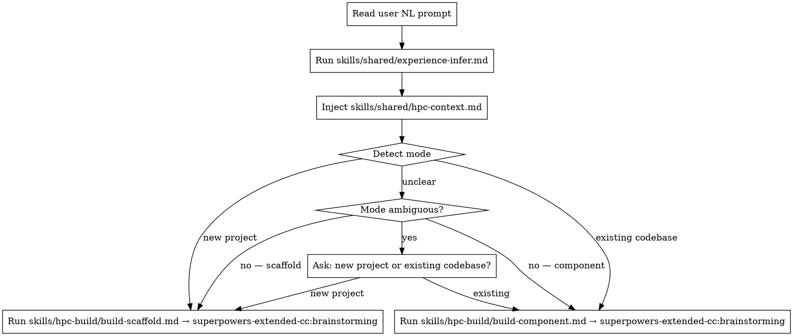

# HPC Build

**Core principle:** Route HPC build requests to the right framing, grounded in current library APIs and adapted to experience level.

## When to Use

- "Start a new CUDA project"
- "Add a TBB parallel_for to my existing code"
- "Scaffold a new HPC application with OpenMP"
- "Implement a new cuBLAS GEMM component"

**Not for:** optimizing, debugging, porting, profiling — use the appropriate HPC verb instead.

## Process

## Mode Detection

| Signal | Mode |
|--------|------|
| "new project", "start from scratch", "scaffold", "new application", "fresh repo" | scaffold |
| "my existing code", "add to this", "this codebase", "my loop here", "extend this function" | component |
| No clear signal | Ambiguous → ask one question |

## Delegation

Before invoking superpowers-extended-cc:brainstorming, always:
1. Check `skills/shared/hpc-context.md` → read the `Last updated:` date. If >7 days ago, surface: "Your HPC context may be stale — run `/hpc-refresh-context` to update before we proceed. Continue anyway? (y/n)"
2. Run `skills/shared/experience-infer.md` — sets tone and depth
3. Inject `skills/shared/hpc-context.md` — grounds guidance in current APIs
4. Load framing from `skills/hpc-build/build-scaffold.md` OR `skills/hpc-build/build-component.md`

Then invoke **superpowers-extended-cc:brainstorming** with that context.

## Red Flags

- Skipping experience inference → always run it first
- Skipping hpc-context injection → always inject before brainstorming
- Asking more than one mode-detection question → one question maximum
- Starting to write code before brainstorming completes → HARD GATE: let brainstorming finish
