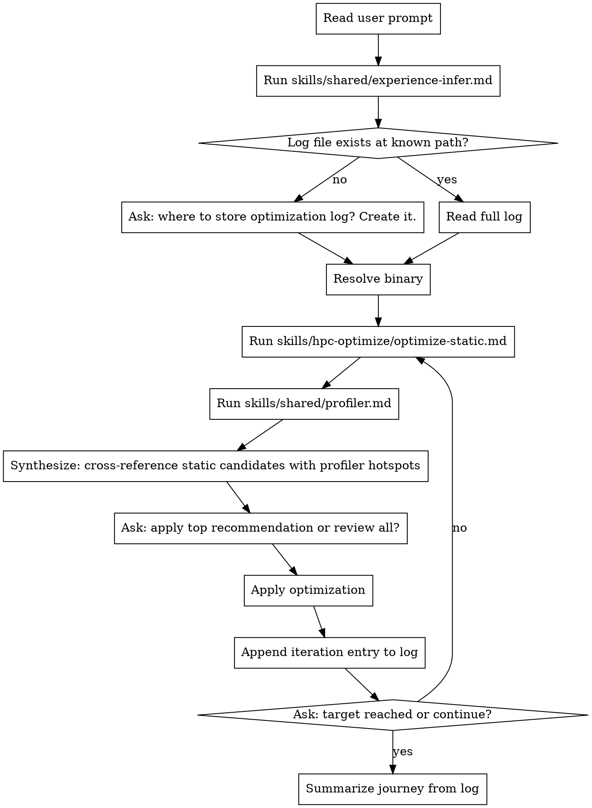

# HPC Optimize

**Core principle:** Static analysis generates hotspot candidates. The profiler always runs to confirm them. Optimization decisions are made from profiler-validated evidence. Progress is logged every iteration.

## When to Use

- "Optimize my CUDA kernel"
- "Speed up this TBB parallel_for"
- "My OpenMP loop is slower than expected"
- "Profile and fix this HPC bottleneck"

**Not for:** building from scratch (`hpc-build`), porting between libraries (`hpc-port`), or debugging correctness (`hpc-debug`).

## Process



## Binary Resolution

1. Ask: "What is the path to your binary and the arguments to run it?"
2. If user doesn't know:
   - Run: `find build/ -type f -executable 2>/dev/null` to list candidates
   - Scan `CMakeLists.txt` for `add_executable` target names
   - Present numbered list: "Found: (1) build/bin/matmul  (2) build/tests/unit_tests — which one?"
3. Always confirm full invocation before running: "I'll run: `./build/bin/matmul --size 4096` — correct?"

## Log Format

One entry appended per completed iteration:

```markdown
## Run N — YYYY-MM-DD
**Binary:** `<path> <args>`
**Profiler:** <tool>

**Static candidates:**
1. `<symbol>` — <pattern> (<file:line>)

**Profiler output (summary):**
- `<symbol>`: <% runtime>, <bottleneck signal>

**Optimization applied:** <description>
**Result:** <before> → <after> (<% change>)
**Hotspot shift:** <new dominant hotspot, or "none">

---
```

## Synthesis Step

After static analysis and profiling both complete, cross-reference results:

```
Confirmed hotspots (both static + profiler):
  1. <symbol> — <pattern> — <% runtime>   ← highest priority

Profiler-only (static missed):
  2. <symbol> — <% runtime> — (pattern not in hpc-context)

Static-only (not confirmed by profiler — skip for now):
  - <symbol> — <pattern> — not in top profiler hotspots
```

Pattern not in hpc-context → note: "Consider running `/hpc-refresh-context` to update domain knowledge."

## Error Handling

| Failure | Action |
|---------|--------|
| No profiler in PATH | Hard stop. Output install instructions from `skills/shared/profiler.md`. Do not proceed. |
| Binary crashes under profiler | Surface stderr. Ask: "Rebuild with `-g -O2`? Check args?" Do not guess. |
| Log path has unrelated content | Warn before writing. Ask: "Overwrite / append / choose new path?" |
| No source files found | Ask user to specify files or point to `CMakeLists.txt` |

## Red Flags

- Applying an optimization not confirmed by profiler → always cross-reference both sources
- Skipping the profiler because static analysis looks conclusive → profiler is never optional
- Re-asking experience level on the second iteration → infer once per session, carry forward
- Reporting % improvement without re-running profiler → always re-profile before claiming gain
- Marking a hotspot resolved without running the profiler to confirm the gain → re-profile required
