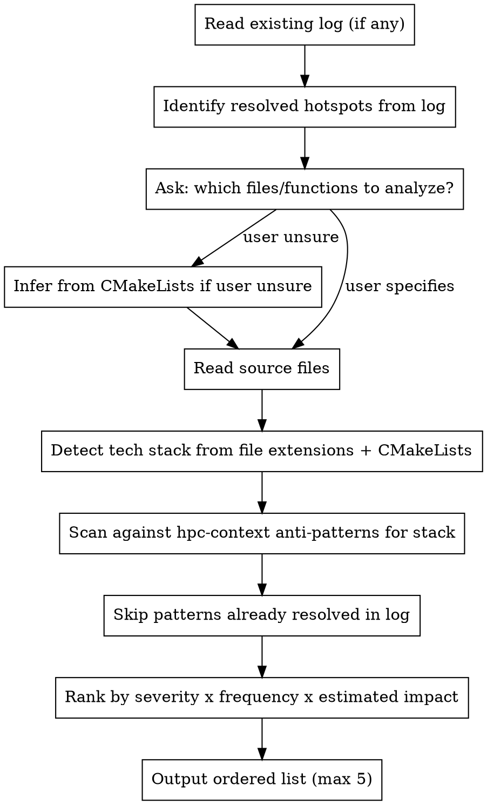

# HPC Optimize — Static Analysis

**Core principle:** Read the code. Map it against known anti-patterns in hpc-context.md. Rank candidates. Output hypotheses for the profiler to validate. Do not run anything.

## Process



## Anti-Pattern Scan by Stack

### CUDA (scan `.cu`, `.cuh` files)

| Anti-pattern | Signal in code |
|-------------|----------------|
| Uncoalesced global memory (AoS layout) | Struct array indexed by `threadIdx` where struct fields accessed across threads |
| Shared memory bank conflicts | `__shared__` array indexed with stride divisible by 32 |
| Warp divergence | `if (threadIdx.x % N)` where N is not `warpSize` |
| Missing `__syncthreads()` | Write to `__shared__` followed by read with no sync between |
| `cudaDeviceSynchronize` in loop | `cudaDeviceSynchronize()` call inside a `for` or `while` body |
| Non-pinned host memory with async copy | `cudaMemcpyAsync` with host pointer not allocated via `cudaMallocHost` |
| UM without prefetch | `cudaMallocManaged` with no `cudaMemPrefetchAsync` before first kernel |

### TBB (scan `.cpp`, `.h` files with `#include <tbb/...>`)

| Anti-pattern | Signal in code |
|-------------|----------------|
| Grain too fine | `parallel_for` with `blocked_range` grain argument of 1 |
| False sharing | `std::vector<int>` or `std::vector<double>` indexed by thread ID via `tbb::this_task_arena::current_thread_index()` |
| `concurrent_hash_map` accessor held too long | `accessor` constructed and used across multiple map operations in same scope |
| Flow graph for simple fork-join | `tbb::flow::graph` with only 2–3 nodes and no complex dependency chain |
| Missing `tbbmalloc` | `std::make_unique`, `std::make_shared`, or bare `new` inside `parallel_for` body |

### OpenMP (scan files with `#pragma omp`)

| Anti-pattern | Signal in code |
|-------------|----------------|
| `default(shared)` data race risk | `#pragma omp parallel` without `default(none)` + mutable variable in body |
| False sharing | `int result[N]` or similar per-thread array indexed by `omp_get_thread_num()` |
| Unnamed `critical` bottleneck | Two or more `#pragma omp critical` without name qualifiers |
| `private` where `firstprivate` needed | Variable initialized before `parallel for` but declared `private` |
| `nowait` with dependent data | `nowait` on a loop whose output is consumed immediately after |
| Missing `taskwait` | `#pragma omp task` with result read before a `#pragma omp taskwait` |
| Nested parallelism oversubscription | `#pragma omp parallel` inside another `parallel` region without `omp_set_max_active_levels(1)` |
| Non-perfect `collapse` | `collapse(2)` on loops with any code between the two loop headers |

### Taskflow (scan files with `#include <taskflow/...>`)

| Anti-pattern | Signal in code |
|-------------|----------------|
| Dangling lambda captures | `[&]` in task lambda capturing a local variable that may go out of scope before task runs |
| New `Taskflow` per hot-loop iteration | `tf::Taskflow` constructed inside a `for` or `while` loop body |
| Nested executor deadlock | `executor.run(tf).wait()` called from within a running task body |

## Output Contract

```
Static candidates (before profiling):
1. [HIGH] <symbol/file:line> — <pattern name>
   Why likely hot: <one sentence>
2. [MED] ...
3. ...
(max 5; patterns already resolved in log are omitted)
```

Severity: HIGH = known to dominate runtime in this pattern; MED = likely contributor; LOW = possible but speculative.

Does not run anything. Does not write to log. Does not make optimization recommendations.

## Red Flags

- Recommending an optimization in this phase → output candidates only, not fixes
- Including more than 5 candidates → rank and cut; quality over quantity
- Re-listing a pattern already marked resolved in the log → always check log first
