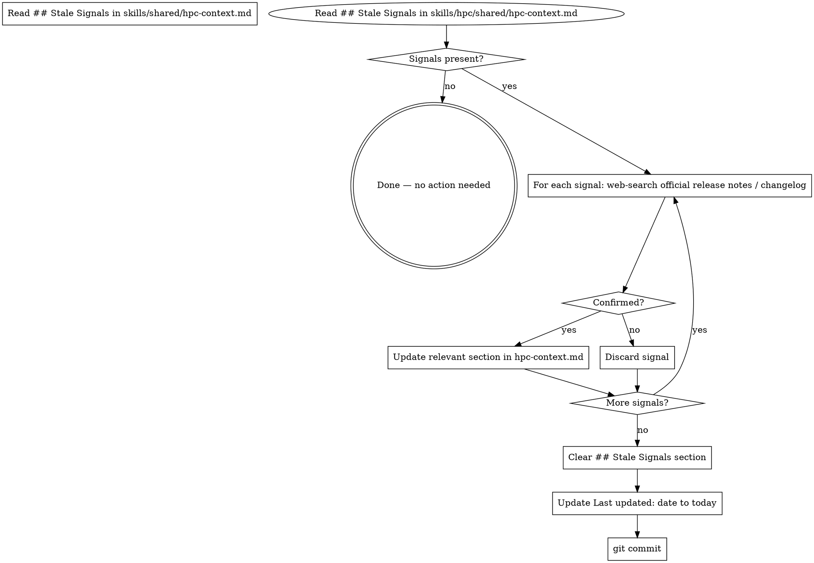

# HPC Refresh Context

**Core principle:** Confirmed signals get applied; unconfirmed signals get discarded. Main content sections are only modified after web-search confirmation.

## Process



## What "Confirm" Means

For each signal (e.g., "oneTBB 2022.1 removes `parallel_pipeline`"):
- Web-search: official Intel oneTBB changelog, NVIDIA CUDA release notes, or Taskflow GitHub releases
- If the source is official and the change is real → confirmed
- If the source is a blog post, StackOverflow, or unverifiable → discard

## File to Modify

`skills/shared/hpc-context.md`

Apply confirmed updates to the relevant section:
- Deprecations → add row to Deprecations table
- New API → add to appropriate Quick Reference or API section
- Changed behavior → update the relevant paragraph inline

After all signals processed:
1. Clear the `## Stale Signals` section body (keep heading, set body to: `*No signals. Add entries here manually or via web search when stack updates are found.*`)
2. Update the `Last updated:` date at the top to today's date (`YYYY-MM-DD`)

## Commit

```bash
git add skills/hpc/shared/hpc-context.md
git commit -m "chore: refresh hpc-context — applied N confirmed signals, discarded M"
```

## Red Flags

- Applying an unconfirmed signal → always web-search first
- Modifying main content sections without a corresponding signal → do not make unprompted edits
- Leaving the Stale Signals section populated after refresh → always clear it at the end
- Forgetting to update `Last updated:` date → the launch-time stale check depends on this
