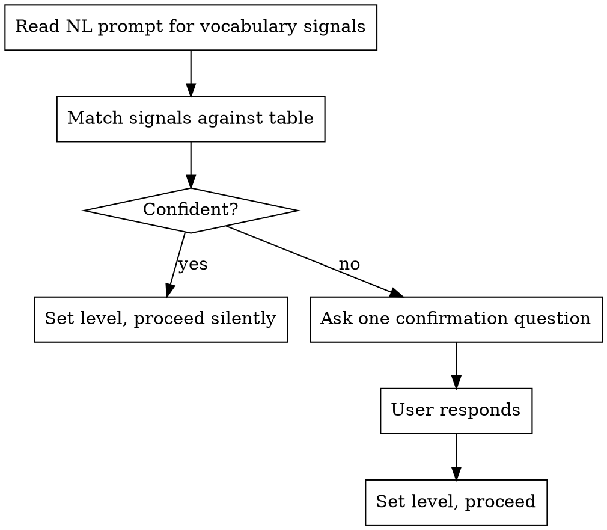

# HPC Experience Inference

**Core principle:** Infer silently when confident. Ask exactly one question when ambiguous. Never ask for an upfront rating.

## Process

## Signal → Level Mapping

| Signals in prompt | Inferred level |
|-------------------|----------------|
| "unified memory", "task_arena affinity", "warp divergence", "concurrent_vector grow_by", "delta-stepping", "cooperative groups", "cudaFlowCapturer", "ScalablePipeline" | Expert |
| "parallel_for", "CUDA kernel", "TBB loop", "OpenMP pragma", "shared memory", "parallel reduce" | Intermediate |
| "make it faster", "use the GPU", "parallel version", "speed up my code" | Beginner |
| Mixed signals from different levels | Ambiguous → confirm |

**Confident** = all signals map to one level. **Ambiguous** = signals span two or more levels.

## The One Confirmation Question

When ambiguous, ask exactly:
> "Are you familiar with [most advanced term they used], or would you like me to explain it as we go?"

Accept any answer. Do not ask follow-up questions. Proceed.

## Level → Output Shape

| Level | Tone | Terminology | Scaffolding |
|-------|------|-------------|-------------|
| Expert | Terse, peer | Full API names and signatures | Minimal — assume pattern knowledge |
| Intermediate | Collaborative | Library names with one-line reminder | Show pattern once |
| Beginner | Guiding | Plain English first, then API name | Explain each step |

## Red Flags

- Asking more than one experience question → STOP, accept the user's first answer and proceed
- Asking for an upfront rating ("rate your experience 1–5") → NEVER do this
- Skipping inference and defaulting to intermediate → always infer from signals first
