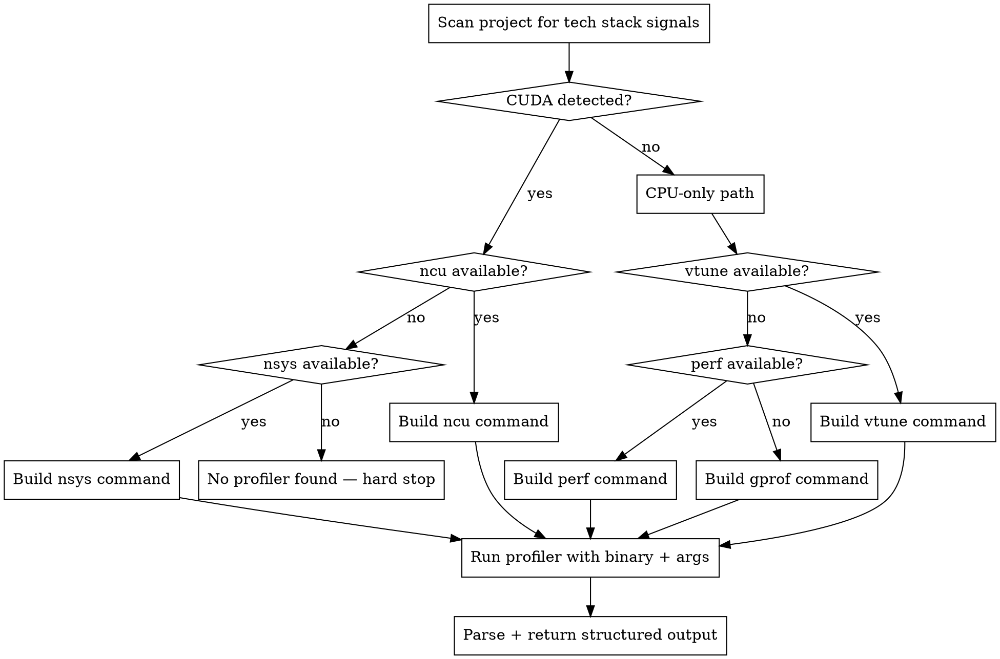

# HPC Profiler — Auto-detect + Invocation

**Core principle:** Detect the right profiler for the tech stack, build the correct invocation, run it, and return structured output. Never make optimization suggestions — only report.

## Process



## Stack Detection

Scan the project root for these signals in order:

1. `.cu` or `.cuh` files present, OR `find_package(CUDA` or `find_package(CUDAToolkit` in any `CMakeLists.txt` → **CUDA detected**
2. CUDA detected: `which ncu` → Nsight Compute; else `which nsys` → Nsight Systems; else hard stop
3. CPU-only: `which vtune` → VTune; else `which perf` → perf; else gprof

**Mixed CUDA + CPU:** prefer Nsight Systems (`nsys`) — covers both CPU and GPU timelines.

## Tool Selection + Commands

| Stack | Profiler | Command |
|-------|----------|---------|
| CUDA, `ncu` available | Nsight Compute | `ncu --set full -o ncu_profile <binary> <args>` |
| CUDA + CPU mixed, or no `ncu` | Nsight Systems | `nsys profile -o nsys_profile <binary> <args>` |
| CPU + TBB/OpenMP, VTune available | Intel VTune | `vtune -collect hotspots -result-dir vtune_out -- <binary> <args>` |
| CPU-only, no VTune | perf | `perf record -g -o perf.data <binary> <args> && perf report --stdio -i perf.data` |
| CPU-only, no perf | gprof | Recompile with `-pg -g`, run `<binary> <args>`, then `gprof <binary> gmon.out > gprof_report.txt` |

**gprof recompile note:** If gprof is the only option and the binary was not compiled with `-pg`, instruct the user to add `-pg -g` to `CMAKE_CXX_FLAGS` in CMakeLists.txt and rebuild before continuing.

**Release build check:** Before running, verify the binary was built with `-O2` or higher. Warn if profiling a debug build: "Profiling a debug build gives misleading results — rebuild with Release or RelWithDebInfo first."

## No Profiler Found

If no profiler is detected, output exactly:

```
No profiler found for your stack.
Detected: [CUDA | CPU-only]
Install one of:
  CUDA:    sudo apt install nsight-compute nsight-systems
           OR add /usr/local/cuda/bin to PATH
  CPU/x86: sudo apt install intel-oneapi-vtune
           OR sudo apt install linux-tools-$(uname -r)
```

Hard stop. Do not proceed. Do not fall back to static-only analysis.

## Output Contract

After running, return exactly:

```
Profiler: <tool name>
Binary: <path> <args>
Output file: <path>

Top hotspots:
1. <symbol> — <% runtime> — <bottleneck: memory-bound | compute-bound | latency-bound>
2. ...
(up to 5 hotspots)
```

Do not interpret results. Do not suggest optimizations. Reporting only.

## Red Flags

- Proceeding to optimize without profiler output → profiler is never optional
- Guessing the binary path without user confirmation → always confirm before running
- Reporting results from a debug build → warn and offer to rebuild as Release first
